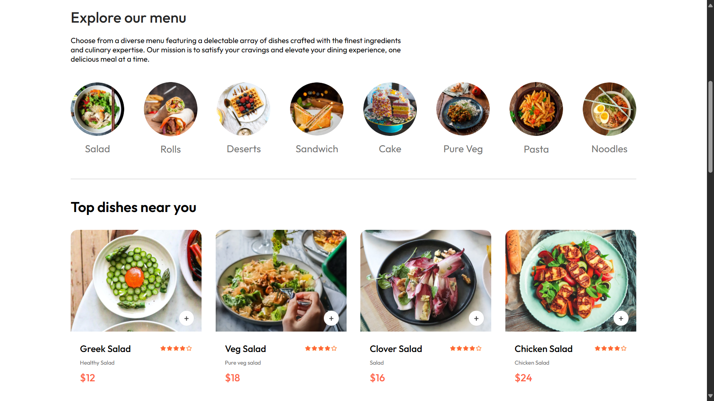
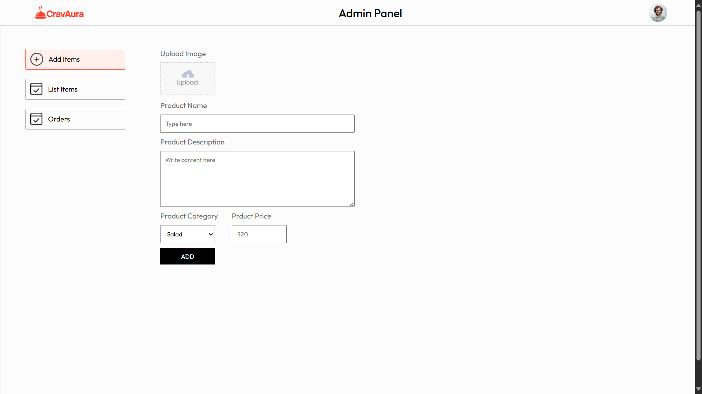

<h1 align="center">🍽️ CravAura - Food Delivery Website</h1>

<h3 align="center">CravAura is your go-to destination for delicious meals delivered fresh and fast. We bring the best local flavors right to your doorstep with just a few clicks.
</h3>
<h3 align="center">"Satisfy Your Cravings, Feel the Aura."</h3>

---

## 🚀 Features

- 🍔 Browse a wide variety of dishes by category
- 🛒 Add to cart and manage orders
- 🔐 Secure login and user authentication
- 💳 Stripe-based online payments
- 📍 Delivery address input and order tracking
- 🛠️ Admin panel for adding and managing food items
- 📱 Fully responsive across all screen sizes
- 📦 Order history tracking

---

## 🛠️ Built With

### 🔧 Frontend
- React.js

### 🔧 Backend
- Node.js
- Express.js

### 🔧 Database
- MongoDB 

---

## 📸 Screenshots

### 🖼️ Homepage

### 🍔 Food Menu

### 🛠️ Admin Panel

---

## 🛡️ Security Features
- **Authentication**: JSON Web Token (JWT)
- **Payment Gateway**: Stripe

---

## 👨‍💻 Made with ❤️ by

# Abhijeet Mohite
